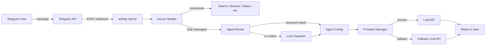

<p align="center">
  <h1 align="center">🦀 PicoClaw-RenderDockerImage</h1>
  <p align="center">A personal AI assistant controlled entirely via Telegram</p>
</p>

<p align="center">
  
  
  
  
  
</p>

---

PicoClaw is a Telegram-based personal productivity agent that answers questions using multiple LLM providers, runs whitelisted shell commands, manages reminders and notes, searches the web, browses URLs, handles email, and integrates with GitHub — all from a single Docker container deployed on Render.com's free tier.

## ✨ Features

| Feature | Description |
|---|---|
| **Multi-LLM Chat** | Conversational AI via OpenRouter, Groq, Google Gemini, and DeepSeek |
| **Smart Agent Routing** | Hybrid keyword + LLM classifier routes messages to specialized agents |
| **Web Search** | DuckDuckGo search with LLM-powered summarization |
| **URL Browsing** | Fetch any webpage, extract text, and summarize with LLM |
| **Reminders** | Persistent reminders stored in MySQL, loaded on startup via APScheduler |
| **Notes** | Per-chat note management with search and tagging |
| **Shortcuts** | Custom command shortcuts that expand into full messages |
| **Command Execution** | Run whitelisted shell commands with output capture |
| **Email** | Send emails via SMTP and check inbox via IMAP |
| **GitHub** | List repos, issues, and recent commits via GitHub API |
| **Session Management** | Per-chat model/agent overrides and message tracking |
| **Owner-Only Access** | Whitelisted Telegram chat IDs — unauthorized users are silently rejected |

## 🏗️ Architecture

```
User → Telegram → POST /webhook → bot.py → agent_router → providers → reply
```



### Agent Routing

PicoClaw uses a hybrid routing system to direct messages to the right agent:

1. **Keyword matching** — predefined keywords in [`config.json`](config.json) map to agents
2. **LLM classifier** — if no keyword matches, an LLM classifies the message

| Agent | Purpose | Default Provider |
|---|---|---|
| `default` | General conversation | OpenRouter (Mistral 7B) |
| `reason` | Analytical / reasoning tasks | DeepSeek (Reasoner) |
| `search` | Web search related | Groq (LLaMA 3 70B) |
| `creative` | Writing and creative tasks | Google (Gemini 1.5 Flash) |

Each agent has a **primary model** and a **fallback** for reliability.

## 📁 Project Structure

```
picoclaw/
├── AGENTS.md              # AI agent rules and project spec
├── config.json            # Providers, agents, routing, bot settings
├── Dockerfile             # Container definition
├── requirements.txt       # Python dependencies
├── .env.example           # Environment variables template
├── render.yaml            # Render one-click deploy config
├── README.md              # You are here
└── src/
    ├── main.py            # Entry point: aiohttp webhook server
    ├── bot.py             # Telegram command handlers and message routing
    ├── config.py          # Loads config.json + resolves env var placeholders
    ├── db.py              # MySQL: conversation history, reminders, notes, shortcuts, sessions
    ├── providers.py       # Multi-provider LLM abstraction with fallback
    ├── agent_router.py    # Hybrid keyword + LLM task routing
    ├── llm.py             # Thin wrapper over agent_router
    ├── search.py          # DuckDuckGo web search + LLM summarization
    ├── browser.py         # URL fetching with BeautifulSoup + LLM summarization
    ├── notes.py           # Notes CRUD operations
    ├── shortcuts.py       # Command shortcut expansion
    ├── scheduler.py       # APScheduler reminders (persistent, loaded from DB)
    ├── tasks.py           # Whitelisted shell command execution
    ├── email_handler.py   # SMTP send + IMAP inbox
    └── github_handler.py  # GitHub REST API operations
```

## 🚀 Getting Started

### Prerequisites

- **Python 3.11+**
- **MySQL database** (e.g., cPanel-hosted MySQL)
- **Telegram Bot Token** from [@BotFather](https://t.me/BotFather)
- At least one LLM provider API key (OpenRouter, Groq, Google, or DeepSeek)

### 1. Clone the Repository

```bash
git clone https://github.com/your-username/picoclaw.git
cd picoclaw
```

### 2. Configure Environment Variables

```bash
cp .env.example .env
```

Edit `.env` and fill in the required values:

| Variable | Required | Description |
|---|---|---|
| `TELEGRAM_BOT_TOKEN` | ✅ | Bot token from @BotFather |
| `RENDER_APP_URL` | ✅ | Your Render app URL (no trailing slash) |
| `ALLOWED_CHAT_IDS` | ✅ | Comma-separated Telegram chat IDs |
| `MYSQL_HOST` | ✅ | MySQL server hostname |
| `MYSQL_USER` | ✅ | MySQL username |
| `MYSQL_PASSWORD` | ✅ | MySQL password |
| `MYSQL_DB` | ✅ | MySQL database name |
| `OPENROUTER_API_KEY` | ⚡ | OpenRouter API key |
| `GROQ_API_KEY` | ⚡ | Groq API key |
| `GOOGLE_API_KEY` | ⚡ | Google AI API key |
| `DEEPSEEK_API_KEY` | ⚡ | DeepSeek API key |
| `EMAIL_ADDRESS` | ❌ | Email for send/inbox features |
| `EMAIL_PASSWORD` | ❌ | Email app password |
| `SMTP_SERVER` | ❌ | SMTP server hostname |
| `IMAP_SERVER` | ❌ | IMAP server hostname |
| `GITHUB_TOKEN` | ❌ | GitHub personal access token |
| `GITHUB_USERNAME` | ❌ | GitHub username |

> ✅ = Required &nbsp; ⚡ = At least one provider key required &nbsp; ❌ = Optional

### 3. Run Locally

```bash
pip install -r requirements.txt
python -m src.main
```

The server starts on port `8080` (or the value of `PORT` env var) with:
- `GET /health` — health check endpoint (returns 200 OK)
- `POST /webhook` — Telegram webhook receiver

### 4. Run with Docker

```bash
docker build -t picoclaw .
docker run -p 8080:8080 --env-file .env picoclaw
```

## ☁️ Deploy to Render

PicoClaw includes a [`render.yaml`](render.yaml) for one-click deployment:

1. Push the repo to GitHub
2. Connect the repo to [Render](https://render.com)
3. Create a new **Web Service** → select **Docker** runtime
4. Set all environment variables in the Render dashboard
5. Deploy — Render will build the Docker image and start the service

The bot auto-registers its webhook URL with Telegram on startup.

> **Note:** Render free tier sleeps after 15 minutes of inactivity. The bot will wake up on the next incoming webhook, but there may be a cold-start delay.

## 💬 Telegram Commands

| Command | Description |
|---|---|
| `/start` | Introduction message |
| `/help` | List all available commands |
| `/search <query>` | Search the web and get an LLM summary |
| `/browse <url>` | Fetch a URL and summarize its content |
| `/remind <time> <msg>` | Set a reminder (e.g., `10m`, `2h`, `tomorrow 9`) |
| `/reminders` | List all active reminders |
| `/cancelreminder <id>` | Cancel a reminder by ID |
| `/note <text>` | Save a note |
| `/notes` | List all saved notes |
| `/deletenote <id>` | Delete a note by ID |
| `/run <command>` | Execute a whitelisted shell command |
| `/model` | View current model |
| `/model <provider/model>` | Override model for this session |
| `/model list` | List all available models |
| `/model reset` | Clear model override |
| `/agent <name>` | Force a specific agent |
| `/agent reset` | Return to auto-routing |
| `/shortcut add <trigger> <expansion>` | Create a command shortcut |
| `/shortcut list` | List all shortcuts |
| `/shortcut remove <trigger>` | Delete a shortcut |
| `/config` | View bot configuration |
| `/session` | View session state |
| `/session reset` | Reset session overrides |
| `/clear` | Clear conversation history |
| `/status` | Bot uptime and stats |
| `/email <to> <subject> <body>` | Send an email |
| `/inbox` | Check last 5 unread emails |
| `/gh repos` | List GitHub repositories |
| `/gh issues <repo>` | List open issues for a repo |
| `/gh commits <repo>` | List recent commits for a repo |

Any message **without** a `/` prefix is treated as a chat message sent to the LLM.

## 🗄️ Database Schema

PicoClaw uses MySQL with the following tables (auto-created on startup):

| Table | Purpose |
|---|---|
| `conversation_history` | Per-chat message history (capped at `MAX_HISTORY` pairs) |
| `reminders` | Persistent reminders (loaded into APScheduler on startup) |
| `command_logs` | Shell command execution logs (30-day rolling retention) |
| `sessions` | Per-chat model/agent overrides and message counts |
| `notes` | Per-chat notes with optional tags |
| `shortcuts` | Per-chat command shortcuts (trigger → expansion) |

## 🔒 Security

- **Owner-only access** — only Telegram chat IDs listed in `ALLOWED_CHAT_IDS` can interact with the bot
- **Silent rejection** — unauthorized users receive no response (no information leakage)
- **Command whitelist** — `/run` only executes commands from a predefined whitelist: `ls`, `pwd`, `date`, `uptime`, `df`, `free`, `echo`
- **No hardcoded secrets** — all API keys and credentials are loaded from environment variables
- **Env var placeholders** — `config.json` uses `${ENV_VAR}` syntax resolved at runtime by [`config.py`](src/config.py:36)

## ⚙️ Configuration

The [`config.json`](config.json) file controls providers, agents, routing, and bot settings:

```jsonc
{
  "providers": {
    "openrouter": { "api_key": "${OPENROUTER_API_KEY}", "base_url": "...", "models": [...] },
    "groq": { "api_key": "${GROQ_API_KEY}", "base_url": "...", "models": [...] },
    "google": { "api_key": "${GOOGLE_API_KEY}", "base_url": "...", "models": [...] },
    "deepseek": { "api_key": "${DEEPSEEK_API_KEY}", "base_url": "...", "models": [...] }
  },
  "agents": {
    "default": { "provider": "openrouter", "model": "...", "fallback": "..." },
    "reason": { "provider": "deepseek", "model": "...", "fallback": "..." },
    "search": { "provider": "groq", "model": "...", "fallback": "..." },
    "creative": { "provider": "google", "model": "...", "fallback": "..." }
  },
  "routing": {
    "keywords": { "reason": [...], "search": [...], "creative": [...] },
    "llm_classifier": true,
    "classifier_model": "openrouter/mistralai/mistral-7b-instruct:free"
  },
  "bot": { "name": "PicoClaw", "personality": "...", "max_history": 20, "commands": [...] }
}
```

## 🛠️ Tech Stack

| Layer | Technology |
|---|---|
| Bot Interface | [python-telegram-bot](https://github.com/python-telegram-bot/python-telegram-bot) v21+ |
| Webhook Server | [aiohttp](https://docs.aiohttp.org/) |
| LLM Providers | OpenRouter, Groq, Google Gemini, DeepSeek (via OpenAI-compatible API) |
| Web Search | [duckduckgo-search](https://pypi.org/project/duckduckgo-search/) |
| URL Browsing | [httpx](https://www.python-httpx.org/) + [BeautifulSoup4](https://www.crummy.com/software/BeautifulSoup/) |
| Scheduler | [APScheduler](https://apscheduler.readthedocs.io/) (AsyncIOScheduler) |
| Database | MySQL via [aiomysql](https://github.com/aio-libs/aiomysql) |
| Email | [aiosmtplib](https://aiosmtplib.readthedocs.io/) + [aioimaplib](https://github.com/bamthomas/aioimaplib) |
| HTML Parsing | [lxml](https://lxml.de/) |
| Container | Docker (python:3.11-slim) |
| Hosting | [Render.com](https://render.com) (free tier) |

## 📝 License

This project is for personal use. See the repository for license details.
