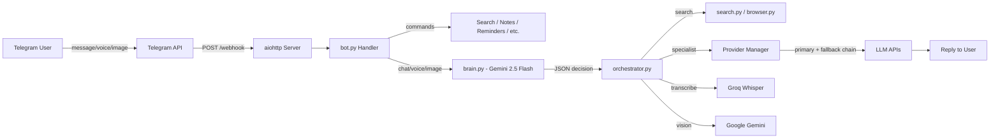

<p align="center">
  <h1 align="center">🦞 PicoClaw</h1>
  <p align="center">A personal AI assistant controlled entirely via Telegram</p>
</p>

<p align="center">
  
  
  
  
  
  
  
</p>

PicoClaw is a Telegram-based personal productivity agent powered by a Gemini 2.5 Flash brain. It answers questions, transcribes voice, analyzes images, searches the web, manages reminders and notes, runs shell commands, handles email, and integrates with GitHub — all from a single Docker container on Render's free tier.

## ✨ Features

| Feature | Description |
|---|---|
| Brain-First Architecture | Gemini 2.5 Flash as central brain — decides action for every message |
| Multi-LLM Providers | OpenRouter, Groq, Google Gemini, DeepSeek with automatic 3-provider fallback chain |
| Voice Messages | Groq Whisper transcription — voice treated identically to typed text |
| Image Analysis | Google Gemini vision — describe and answer questions about photos |
| Web Search | DuckDuckGo search with brain-synthesized answers |
| URL Browsing | Fetch any webpage and summarize with LLM |
| Reminders | Persistent reminders via APScheduler, stored in DB |
| Notes | Per-chat note management with search |
| Shortcuts | Custom command shortcuts that expand into full messages |
| Command Execution | Run whitelisted shell commands with output capture |
| Email | Send via SMTP, check inbox via IMAP |
| GitHub | List repos, issues, recent commits |
| Session Management | Per-chat model/agent overrides |
| Status Indicators | Live status updates: 💭 Thinking... 🔍 Searching... 💻 Coding... |
| Owner-Only Access | Whitelisted chat IDs — unauthorized users silently rejected |
| Destroy Mode | Hidden /destroy command to wipe DB data with rate limiting |

## 🏗️ Architecture

```
User → Telegram → POST /webhook → bot.py → brain.py → orchestrator.py → providers → reply
```



### Brain Decision Actions

| Action | When Used |
|---|---|
| answer_directly | Brain knows confidently, no tools needed |
| search_and_answer | Needs current web data, brain synthesizes after |
| search_only | User explicitly asked to search, raw results returned |
| specialist | Routes to reason / creative / code agent |
| multi_step | Search first, then pass results to specialist |
| transcribe | Voice message received — Groq Whisper |
| vision | Image received — Google Gemini vision |
| embeddings_search | Semantic search through notes |
| code_fim | Code fill-in-middle via DeepSeek FIM |

### Specialist Agents

| Agent | Purpose | Provider |
|---|---|---|
| default | General conversation | Google Gemini 2.5 Flash |
| reason | Analytical and logical tasks | Groq LLaMA 3.3 70B |
| creative | Writing and creative tasks | Google Gemini 2.5 Flash |
| code | Code writing and debugging | Groq LLaMA 3.3 70B |
| search | Web search synthesis | Groq LLaMA 3.3 70B |

Each agent has a primary model and a fallback chain — if primary fails, next provider is tried automatically.

## 📁 Project Structure

```
picoclaw/
├── AGENTS.md              # AI coding agent rules and project spec
├── config.json            # Providers, agents, routing, bot settings
├── Dockerfile             # Container definition
├── requirements.txt       # Python dependencies
├── .env.example           # Environment variables template
├── render.yaml            # Render one-click deploy config
├── README.md              # You are here
└── src/
    ├── main.py            # Entry point: aiohttp webhook server
    ├── bot.py             # Telegram handlers, voice/photo/message routing
    ├── brain.py           # Central intelligence — Gemini decides every action
    ├── orchestrator.py    # Executes brain decisions, calls tools and providers
    ├── config.py          # Loads config.json + resolves env vars
    ├── providers.py       # Multi-provider LLM with fallback chain + Whisper
    ├── db.py              # MySQL: history, reminders, notes, shortcuts, sessions
    ├── search.py          # DuckDuckGo web search
    ├── browser.py         # URL fetching + LLM summarization
    ├── notes.py           # Notes CRUD
    ├── shortcuts.py       # Shortcut expansion
    ├── scheduler.py       # APScheduler reminders
    ├── tasks.py           # Whitelisted shell commands
    ├── email_handler.py   # SMTP send + IMAP inbox
    └── github_handler.py  # GitHub REST API
```

## 🚀 Getting Started

### Prerequisites

- Python 3.11+
- MySQL-compatible database (see Free Database Options below)
- Telegram Bot Token from @BotFather
- Google AI API key (required — brain depends on it)
- At least one additional provider key (Groq recommended for fallback)

### 1. Clone the Repository

```bash
git clone https://github.com/your-username/picoclaw.git
cd picoclaw
```

### 2. Configure Environment Variables

```bash
cp .env.example .env
```

| Variable | Required | Description |
|---|---|---|
| TELEGRAM_BOT_TOKEN | ✅ | Bot token from @BotFather |
| RENDER_APP_URL | ✅ | Your Render app URL (no trailing slash) |
| ALLOWED_CHAT_IDS | ✅ | Comma-separated Telegram chat IDs |
| MYSQL_HOST | ✅ | MySQL server hostname |
| MYSQL_PORT | ✅ | MySQL port (default 3306) |
| MYSQL_USER | ✅ | MySQL username |
| MYSQL_PASSWORD | ✅ | MySQL password |
| MYSQL_DB | ✅ | MySQL database name |
| GOOGLE_API_KEY | ✅ | Google AI API key — required for brain |
| GROQ_API_KEY | ⚡ | Groq API key — recommended for fallback + Whisper |
| OPENROUTER_API_KEY | ⚡ | OpenRouter API key |
| DEEPSEEK_API_KEY | ⚡ | DeepSeek API key (paid models) |
| DESTROY_PASSWORD | ⚡ | Password for hidden /destroy command |
| EMAIL_ADDRESS | ❌ | Email for send/inbox features |
| EMAIL_PASSWORD | ❌ | Email app password |
| SMTP_SERVER | ❌ | SMTP server hostname |
| IMAP_SERVER | ❌ | IMAP server hostname |
| GITHUB_TOKEN | ❌ | GitHub personal access token |
| GITHUB_USERNAME | ❌ | GitHub username |

✅ = Required   ⚡ = At least one required   ❌ = Optional

### 3. Run Locally

```bash
pip install -r requirements.txt
python -m src.main
```

Server starts on port 8080 with:

- GET /health — health check (returns 200 OK)
- POST /webhook — Telegram webhook receiver

### 4. Run with Docker

```bash
docker build -t picoclaw .
docker run -p 8080:8080 --env-file .env picoclaw
```

## 🗄️ Free Database Options

PicoClaw requires a MySQL-compatible database. Two recommended free options:

### Option A — PlanetScale (Recommended)

1. Create a free account at planetscale.com
2. Create a new database
3. Go to Connect → select Connect with: mysql2 → copy credentials
4. Set in .env:

```
MYSQL_HOST=aws.connect.psdb.cloud
MYSQL_PORT=3306
MYSQL_USER=your_planetscale_user
MYSQL_PASSWORD=your_planetscale_password
MYSQL_DB=your_database_name
```

Zero code changes needed — PlanetScale is fully MySQL compatible with aiomysql.

### Option B — cPanel MySQL

If your hosting provider includes cPanel, use the MySQL Databases tool to create a database and user. Set the same env vars with your cPanel host details.

## ☁️ Deploy to Render

PicoClaw includes a render.yaml for one-click deployment:

1. Push repo to GitHub
2. Connect to Render
3. Create new Web Service → select Docker runtime
4. Set all environment variables in Render dashboard
5. Deploy — Render builds the Docker image and starts the service

The bot auto-registers its webhook URL with Telegram on startup.

**Note:** Render free tier sleeps after 15 minutes of inactivity. The bot wakes on the next webhook but may have a cold-start delay.

## 💬 Telegram Commands

| Command | Description |
|---|---|
| /start | Introduction message |
| /help | List all commands |
| /search <query> | Search the web |
| /browse <url> | Fetch and summarize a URL |
| /remind <time> <msg> | Set a reminder (10m, 2h, tomorrow 9am) |
| /reminders | List active reminders |
| /cancelreminder <id> | Cancel a reminder |
| /note <text> | Save a note |
| /notes | List all notes |
| /deletenote <id> | Delete a note |
| /run <command> | Run a whitelisted shell command |
| /model | View current model |
| /model <provider/model> | Override model for this session |
| /model list | List all available models |
| /model reset | Clear model override |
| /agent <name> | Force a specific agent |
| /agent reset | Return to brain auto-routing |
| /shortcut add <trigger> <expansion> | Create a shortcut |
| /shortcut list | List all shortcuts |
| /shortcut remove <trigger> | Remove a shortcut |
| /config | View bot configuration |
| /session | View session state |
| /session reset | Reset session overrides |
| /clear | Clear conversation history |
| /status | Bot uptime and stats |
| /email <to> <subject> <body> | Send an email |
| /inbox | Check last 5 unread emails |
| /gh repos | List GitHub repositories |
| /gh issues <repo> | List open issues |
| /gh commits <repo> | List recent commits |

Any message without `/` prefix goes to the brain for processing. Voice messages and photos are handled automatically.

## 🗑️ Destroy Mode

PicoClaw includes a hidden `/destroy` command for wiping bot data. It does not appear in Telegram's command menu and is never logged to Render or the database.

**Usage:** `/destroy <0|1> <password>`

| Mode | Effect |
|---|---|
| 0 | Wipe everything: conversation history, sessions, logs, notes, shortcuts, reminders |
| 1 | Wipe all except notes, reminders, and destroy_log (rate limit counter preserved) |

**Rate limit:** 2 successful destroy calls per 15 days. Exceeding the limit replies with the exact time remaining.

### Behavior

- Command message deleted from chat immediately — hides password from chat history
- Wrong password replies "Incorrect password." — no other details
- Wrong mode or missing args replies with usage hint
- Rate limit exceeded replies with time remaining e.g. "Rate limit reached. Next destroy available in 12d 4h."
- Successful destroy replies with exactly which tables were wiped and which were preserved
- Never logged to Render or DB under any circumstance

### Security

- Password read from DESTROY_PASSWORD env var only — never hardcoded
- Only ALLOWED_CHAT_IDS users can trigger — all others rejected before destroy logic runs
- Rate limiting prevents accidental repeated data loss

**Setup:** Add to .env:
```
DESTROY_PASSWORD=your_secure_password_here
```

Use a strong unique password. Anyone with your password and chat access can wipe your data.

## 🗄️ Database Schema

Tables auto-created on startup:

| Table | Purpose |
|---|---|
| conversation_history | Per-chat message history (capped at max_history pairs) |
| reminders | Persistent reminders loaded into APScheduler on startup |
| command_logs | Shell command logs (30-day rolling retention) |
| sessions | Per-chat model/agent overrides and message counts |
| notes | Per-chat notes with optional tags |
| shortcuts | Per-chat shortcuts (trigger → expansion) |
| destroy_log | Destroy command audit log for rate limiting |

## 🔒 Security

- Owner-only access — only ALLOWED_CHAT_IDS chat IDs can interact
- Silent rejection — unauthorized users receive no response
- Command whitelist — /run only executes: ls, pwd, date, uptime, df, free, echo
- No hardcoded secrets — all credentials loaded from env vars
- Destroy rate limiting — /destroy limited to 2 calls per 15 days
- Destroy message deletion — password never visible in chat history

## ⚙️ Configuration

config.json controls providers, agents, routing, and bot settings:

```jsonc
{
  "brain": { "provider": "google", "model": "gemini-2.5-flash", "fallback": "groq/llama-3.3-70b-versatile" },
  "providers": {
    "google": { "api_key": "${GOOGLE_API_KEY}", "models": [...] },
    "groq": { "api_key": "${GROQ_API_KEY}", "base_url": "...", "models": [...] },
    "openrouter": { "api_key": "${OPENROUTER_API_KEY}", "base_url": "...", "models": [...] },
    "deepseek": { "api_key": "${DEEPSEEK_API_KEY}", "base_url": "...", "models": [...] }
  },
  "agents": {
    "default": { "provider": "google", "model": "gemini-2.5-flash", "fallback": "..." },
    "reason":  { "provider": "groq", "model": "llama-3.3-70b-versatile", "fallback": "..." },
    "creative":{ "provider": "google", "model": "gemini-2.5-flash", "fallback": "..." },
    "code":    { "provider": "groq", "model": "llama-3.3-70b-versatile", "fallback": "..." }
  },
  "settings": { "free_only": true, "max_response_chars": 4000 },
  "bot": { "name": "PicoClaw", "personality": "...", "max_history": 6 }
}
```

## 🛠️ Tech Stack

| Layer | Technology |
|---|---|
| Bot Interface | python-telegram-bot v21+ |
| Webhook Server | aiohttp |
| Brain | Google Gemini 2.5 Flash (native API) |
| LLM Providers | OpenRouter, Groq, DeepSeek (OpenAI-compatible API) |
| Voice Transcription | Groq Whisper (whisper-large-v3-turbo) |
| Web Search | ddgs (DuckDuckGo) |
| URL Browsing | httpx + BeautifulSoup4 |
| Scheduler | APScheduler (AsyncIOScheduler) |
| Database | MySQL via aiomysql (PlanetScale or cPanel) |
| Email | aiosmtplib + aioimaplib |
| Container | Docker (python:3.11-slim) |
| Hosting | Render.com (free tier) |

## 📝 License

MIT License — see LICENSE for details.
